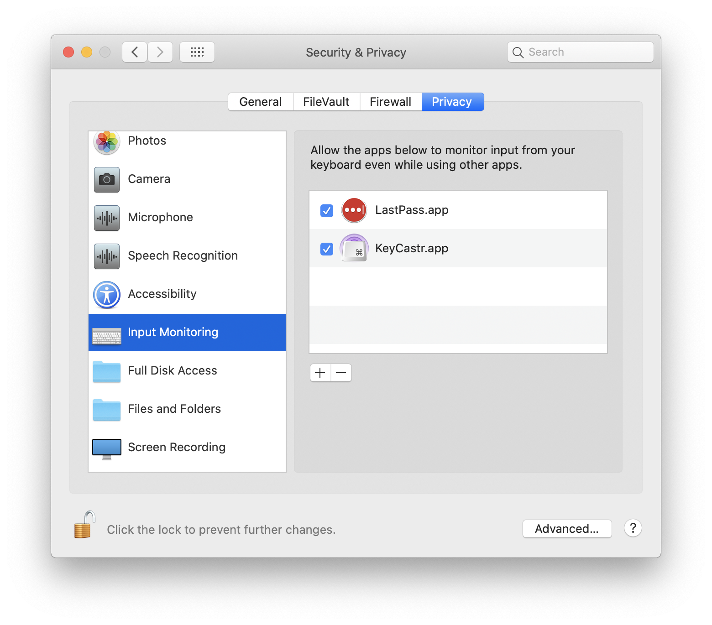
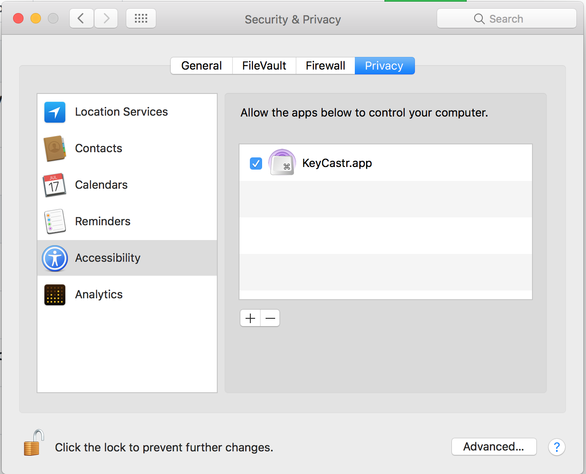
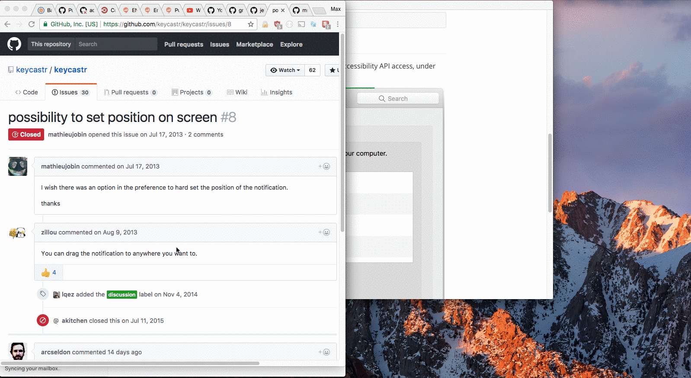

# KeyCastr

KeyCastr, an open source keystroke visualizer.


KeyCastr enables you to share your keystrokes when creating screencasts, presenting, or collaborating with others. You can choose to display all keystrokes or command keys only, and there is also an option to include mouse clicks.

It is also possible to develop your own visualizer on top of KeyCastr -- pull requests are welcome!


## Installation

Download the latest release from [GitHub](https://github.com/keycastr/keycastr/releases)

Or, install using [homebrew](http://brew.sh/)

```console
brew install --cask keycastr
```

## Granting Permissions

KeyCastr requires your permission to receive events from macOS in order to broadcast your keystrokes and mouse clicks.

On newer versions of macOS (10.15+) there is an Input Monitoring menu under Security & Privacy within the System Preferences app, and KeyCastr will appear there automatically the first time you run it. Simply unlock this menu and check the box next to KeyCastr to enable it.



On older versions of macOS, or if for some reason the app doesn't appear under the Input Monitoring menu (or if you want to pre-enable it) then you may manually add it to the list of apps in the Accessibility menu.



To add KeyCastr to the list click the <kbd>&plus;</kbd> button and select KeyCastr from the file system, or drag it in using Finder.

If KeyCastr is already in the list you can remove it with the <kbd>&minus;</kbd> button and add it again in order to be certain that the right copy of the application is specified.

## Position on Screen

The default position is on the bottom left of your display. To modify the position of displayed keystrokes, click and drag the text like so:



## Security Concerns

Any application in the Accessibility or Input Monitoring sections of the Security & Privacy pane in macOS's Preferences.app is capable of receiving all your input events. We encourage you to inspect these lists carefully, remove applications which you don't believe need to monitor your input, and ask tough questions of the companies which produce the software you use.

KeyCastr is completely free and open source, and does not employ any networking mechanisms other than that included with the ubiquitous [Sparkle framework](https://sparkle-project.org/) for managing application updates. KeyCastr will never receive or display your passwords, so long as the website or application you are using treats password entry as secure, e.g. `<input type="password">` or equivalent.


## History and Credits

 - [sdeken](https://github.com/sdeken) wrote the original version.
 - [akitchen](https://github.com/akitchen) occasional development and maintenance.
 - [elia](https://github.com/elia) created `keycastr` organization and forked into it.
 - [lqez](https://github.com/lqez) added a new menu bar icon.
 - [QuintB](https://github.com/QuintB) designed an updated application icon to match the icon style in modern versions of macOS.

## License

[BSD 3-Clause](https://opensource.org/licenses/BSD-3-Clause)

KeyCastr has been freely available for the Mac since 2009.
