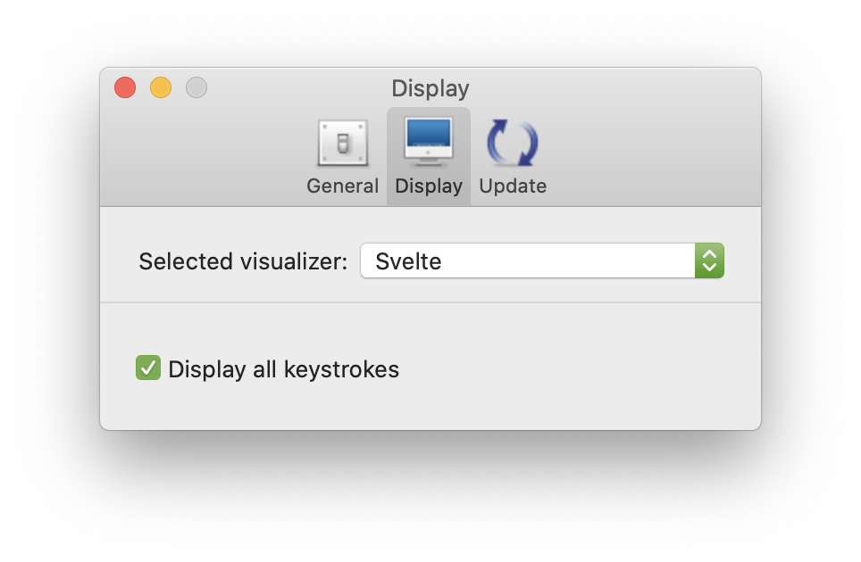

# Keycastr

KeyCastr, an open-source keystroke visualizer.


## Download

 - [Download latest release](https://github.com/keycastr/keycastr/releases)

## Installation via [homebrew](http://brew.sh/) [cask](https://github.com/caskroom/homebrew-cask)

```console
brew cask install keycastr
```

## Accessibility API access

In order to work, KeyCastr must be included in the list of applications with Accessibility API access, under the Security & Privacy system preferences.


To add KeyCastr to the list click the <kbd>&plus;</kbd> button and select KeyCastr from the file system.

> NOTE: If KeyCastr is already in the list, then click the <kbd>&minus;</kbd> button and add KeyCastr again to be certain that the right application is chosen.

## Input Monitoring

Also, KeyCastr needs your explicit permission to to monitor inputs. You can set this in the Input Monitoring section under the Security & Privacy system preferences.


To add KeyCastr to the list click the <kbd>&plus;</kbd> button and select KeyCastr from the file system.

> NOTE: If KeyCastr is already in the list, then click the <kbd>&minus;</kbd> button and add KeyCastr again to be certain that the right application is chosen.


## Displaying All Keystrokes

Make sure to check the "Display all keystrokes" checkbox if you would like to display more than just the modifier keys.

Alternatively, keep this box unchecked to only display modifier keys (e.g. ⇧ ⌃ ⌥ ⌘)




## Position on Screen

The default position is on the bottom left of your display. To modify the position of displayed keystrokes, click and drag the text like so:


## History

 - [sdeken](https://github.com/sdeken/keycastr) wrote the original version.
 - [akitchen](https://github.com/akitchen/keycastr) fixes for more recent OS X releases and other maintenance.
 - [elia](https://github.com/elia/keycastr) created `keycastr` organization and forked into it.
 - [lqez](https://github.com/lqez/keycastr) added a new menu bar icon.


## License

[BSD 3-Clause](https://opensource.org/licenses/BSD-3-Clause)
