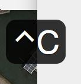

# Keycastr

KeyCastr, an open-source keystroke visualizer.




## Download

 - [Download latest release](https://github.com/keycastr/keycastr/releases)

### Installation via [homebrew](http://brew.sh/) [cask](https://github.com/caskroom/homebrew-cask)

```console
which cask || brew tap caskroom/cask # Get cask if you don't already have it
brew cask install keycastr
```

## History

 - [sdeken](https://github.com/sdeken/keycastr) wrote the original version.
 - [akitchen](https://github.com/akitchen/keycastr) fixes for more recent OS X releases and other maintenance.
 - [elia](https://github.com/elia/keycastr) created `keycastr` organization and forked into it.
 - [lqez](https://github.com/lqez/keycastr) added a new menu bar icon.


## License

BSD 3-Clause
